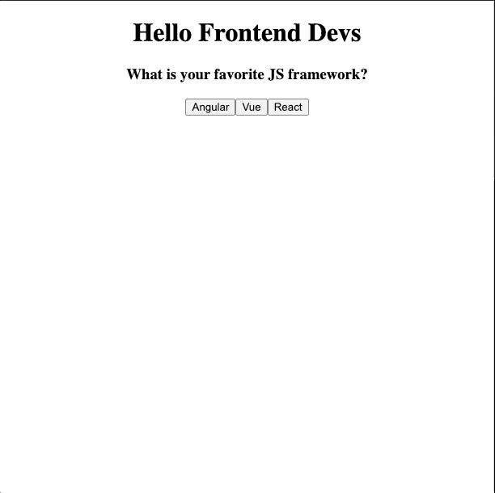

# Framework Picker

## Code by Numbers

Build a component that prompts the user to select their favorite JavaScript framework.

Give them 3 buttons to click: Angular, Vue, and React. When they click a button, a short message should appear along with the logo of the selected framework

> **Toolbox**: For this project you should use
>
> - Component data
> - Text interpolation
> - Component methods & event handling
> - Conditional rendering with `v-if`
> - Attribute binding

# Steps

1. Create a new Vue project in codesandbox and empty out the starter code in `App.vue`

1. Declare a `data` method on the component and add a property for `frameworkSelection` with the initial value of `null`. Create another property for `frameworkImg` and give it the value of `null` as well

1. In the template, create the headers and 3 buttons with the framework names on them.

1. In the component, add a `methods` section and define a method named `selectFramework` which takes in a single parameter called `frameworkName`. The body of the method should update the `frameworkSelection` property.

1. Attach a click handler to each of the buttons to call the `selectFramework` method. Have each of them pass in the string of the Framework name

1. In the template, use `v-if` and create a `
` tag that will only display on the page if `frameworkSelection` is not null.

1. Update the `selectFramework` method to set the `frameworkImg` property depending on what the user has selected. (Do an image search for Angular, Vue, and React logos)

1. Add an `<image/>` tag to the template. The image should only display if `frameworkImg` is not null and it's `src` attribute should be bound to `frameworkImg`. Its `alt` attribute should be bound to `frameworkSelection`
