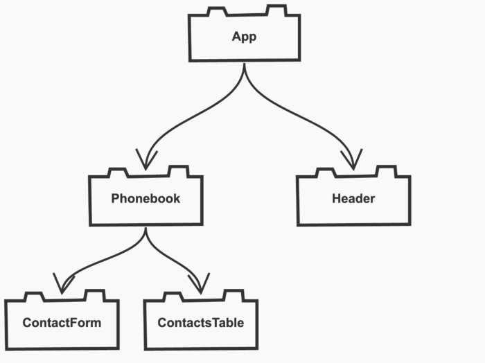

\*\* TODO: Prerequisites: Destructuring, video intro on Vuex, seatgeek API

# Event Dashboard

In this chapter we're going to look at another way to manage state in our application. We'll explore a state management pattern called **Vuex** while we build a dashboard app to show events happening in Nashville

# Why Vuex

The apps we've built so far have fairly simple component trees, which has made managing state relatively easy. As a reminder, here's a look at the component tree we had in our Phonebook application

We saw how we can have components communicate with each other. Parent components can **pass data down via props** and children components can **emit events up** to talk to parents.
